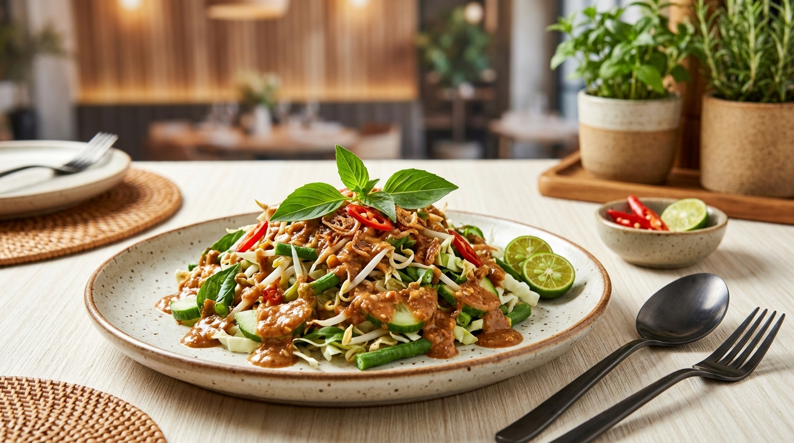

# Website Modern Promosi Makanan Khas Daerah Indonesia: Karedok (Jawa Barat) 🥗🌶️

> **AL FARIDZI KAREDOK** - Mengangkat Industri Makanan Khas Jawa Barat ke Level World-Class & Modern Fast Food Experience (Inspirasi: KFC, Burger Bangor, Pizza Hut, Five Guys).



---

## 📌 Tema Penetapan & Spesifikasi

- **Daerah**: Jawa Barat
- **Makanan Khas**: Karedok (Raw Vegetable Salad dengan Bumbu Kacang Kencur Aromatik)
- **Primary Color Palette**: `#FFFFF0` (Ivory Cream Background) & `#78350F` (Amber Wood Brown)
- **Framework & Tech Stack**: CodeIgniter 4 + Tailwind CSS + MySQL Database
- **GitHub Repository**: [Projek_Framework](https://github.com/rasyy-justastudent/Projek_Framework)

---

## 🌟 Fitur Utama Website

1. **Fast Food UI & Visual Excellence**:
   - Tampilan ultra-modern berstandar restoran fast food internasional.
   - Hero banner interaktif dengan foto makanan AI HD beresolusi tinggi.
   - Sistem Keranjang Belanja (Cart Drawer) & Modal Checkout interaktif.

2. **Fitur Pengurutan (Dynamic Sorting)**:
   - **Harga**: Terendah → Tertinggi & Tertinggi → Terendah
   - **Tingkat Pedas**: Terpedas (Level 1-5 🌶️)
   - **Rating Pelanggan**: Terfavorit (Rating ⭐)
   - **Alphabetical**: Nama A-Z

3. **Validasi Form Strict (CodeIgniter 4 & Client-Side)**:
   - Form Tambah & Edit Menu Karedok dengan pesan validasi komprehensif.
   - Form Checkout Pengiriman dengan validasi input (Nama, Telepon, Alamat, Metode Pembayaran).
   - Sistem Kode Promo (`KAREDOKJUARA` potongan Rp 10.000 & `SUNDA50` potongan Rp 5.000).

4. **Racik Karedok Sendiri (Custom Order Builder)**:
   - Kustomisasi sayuran mentah pilihan (Tauge, Kacang Panjang, Terong Hijau, Kol, Kemangi, Leunca).
   - Slider tingkat pedas cabai rawit real-time (Level 0 - 5).
   - Tambahan Topping Sultan (Lontong Pandan, Tahu & Tempe Goreng, Telur Asin Masir).

5. **Halaman Detail & Manajemen Admin (CRUD)**:
   - Halaman detail terpisah untuk tiap varian Karedok.
   - Panel Admin (`/admin`) untuk mengelola menu (Create, Read, Update, Delete).

---

## 📊 Tahapan Commit Workflow

```bash
1. Commit 1: "Setup database & migration Karedok"
2. Commit 2: "CRUD dasar + tampilan Tailwind Karedok"
3. Commit 3: "Halaman detail + fitur tambahan + gambar AI Karedok"
4. Commit 4: "Finalisasi Karedok" & Push ke GitHub
```

---

## 🛠️ Instalasi & Cara Menggunakan

1. **Clone Repository**:
   ```bash
   git clone https://github.com/rasyy-justastudent/Projek_Framework.git
   cd Projek_Framework
   ```

2. **Setup Konfigurasi Database (`.env`)**:
   ```ini
   database.default.hostname = localhost
   database.default.database = db_karedok_jabar
   database.default.username = root
   database.default.password = 
   database.default.DBDriver = MySQLi
   ```

3. **Jalankan Migrasi & Database Seeder**:
   ```bash
   php spark db:create db_karedok_jabar
   php spark migrate
   php spark db:seed KaredokSeeder
   ```

4. **Jalankan Server Lokal**:
   ```bash
   php spark serve --port 8080
   ```
   Buka di peramban: `http://localhost:8080`

---

## 👨‍💻 Dibuat Oleh
Dibuat untuk Tugas Framework Website Promosi Kuliner Khas Daerah Indonesia - **Jawa Barat (Karedok)**.
